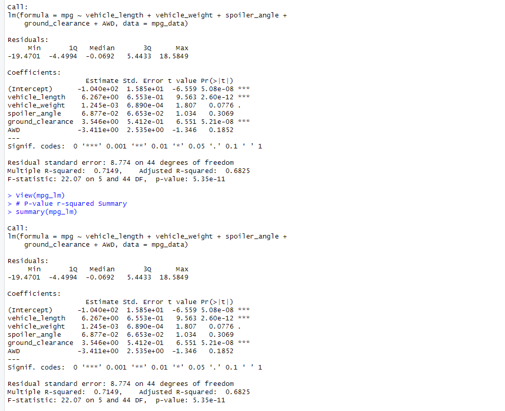
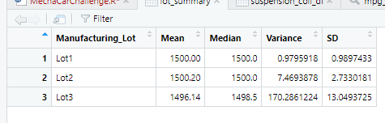
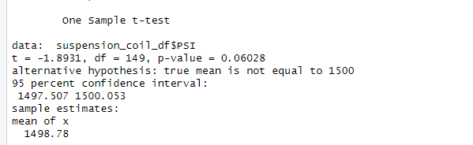
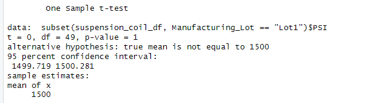
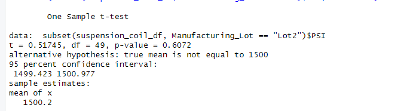

# MechaCar_Statistical_Analysis

## Linear Regression to Predict MPG

#### Which variables/coefficients provided a non-random amount of variance to the mpg values in the dataset?

The variables vehicle_length and ground_clearance provide the non_random amount of variance to the mpg dataset. This is due to their p-values (p <0.05). This means that they variables have a significant impact on the outcome for mpg.

#### Is the slope of the linear model considered to be zero? Why or why not?
No the slope is not considered 0 as the data shows. The coefficients table shows that the independent variables such as vehile_length and vehicle_weight are not zero. 

#### Does this linear model predict mpg of MechaCar prototypes effectively? Why or why not?
The linear model does predict effectively to a certain degree this is due to the p-value vehicle_weight variable being at 0.0076 which is greater than 0.05.

## Summary Statistics on Suspension Coils

#### The design specifications for the MechaCar suspension coils dictate that the variance of the suspension coils must not exceed 100 pounds per square inch. Does the current manufacturing data meet this design specification for all manufacturing lots in total and each lot individually? Why or why not?

The total data as shown in the summaries shows that they meet the 100 PSI specifications but Lo3 is an outlier as it has a variance that is at 170.28.

## T-Tests on Suspension Coils
An Overall view of the t-test shows that the p-value is not low enough for us to reject the null hypothesis.

Both lot 1 and 2 are not low enough for us to reject the null hypothesis at 0.6072 p-value

Lot 3 on the other hand is not low enough to reject but being at 0.04168 it would require a closer look.

